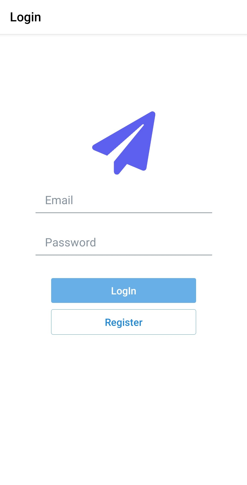
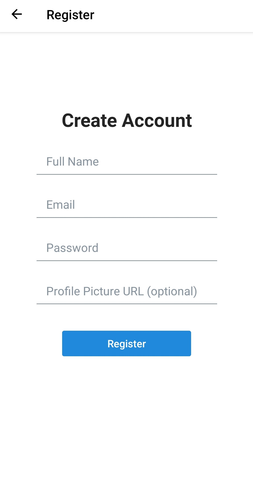
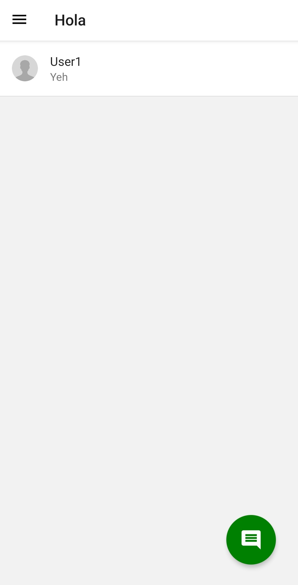
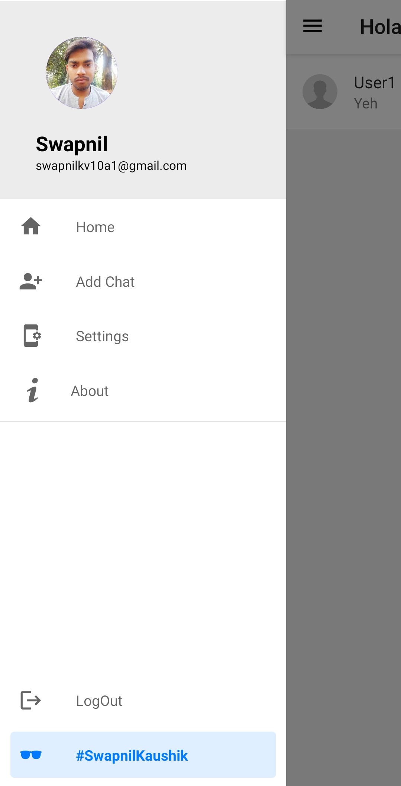
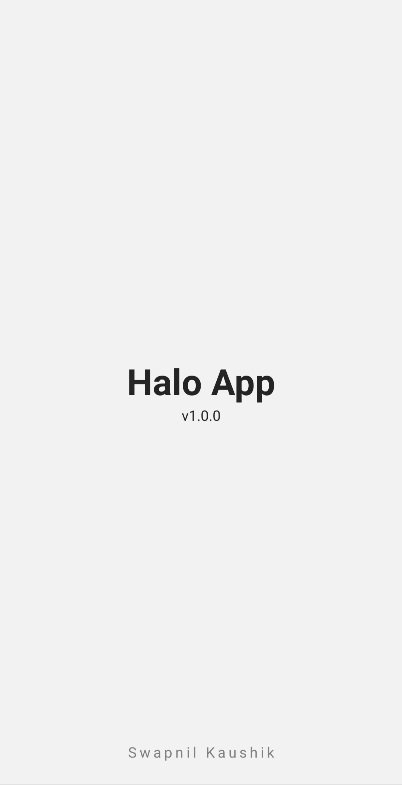

# Hola-ReactNative
It is a real time messaging app using ReactNative and firebase.

**To see in action use below links**
> _<a href="">Web View</a> (Firebase deployment)_
>  
> _<a href="">iOS & Android View</a> (Expo deployment)_

# Description
It is a Real-Time messaging application build with _ReactNative_ and _Firebase_.
 I have used Firebase as Database for storing the users details
 and ReactNative for UI and database interaction **(and most importantly to make it cross-flatform app)**
 As it is build on ReactNative it can run on iOS, Android and Web with the same code.

### It has following functionalities
1. Register/Login
2. Individual chat with other users
3. Edit Details
4. Change Password
5. Delete account and etc

# Various Secreens

### Splash Screen
> 

### LogIn Screen
> 

### Register Screen
> 

### Home Screen
> 

### Navigation Drawer
> 
> 
### Add Chat Screen
> 

### Settings Screen
> 

### About Screen
> 
